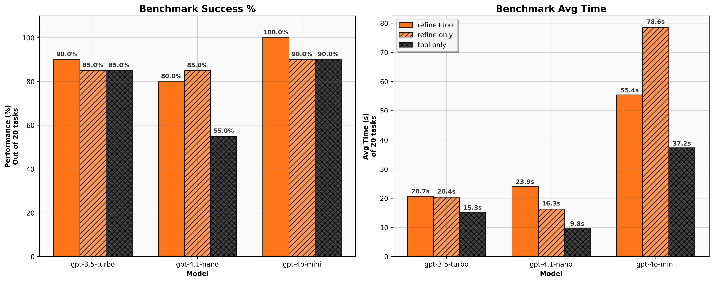

# Agent Experiment Reflection

This document summarizes benchmark runs on the OpenTitan bug‑fix tasks. The bar
plots in `plots/benchmark_results.png` were produced with
`python scripts/plot_results.py` and compare three agent configurations for each
model:

- **refine+tool** – iterative self‑refinement and the Verilator tool enabled.
- **refine only** – refinement enabled but Verilator disabled.
- **tool only** – Verilator available but no self‑refinement.

Each configuration attempts all 20 tasks.

## Benchmark Results

| Model           | Config        | Success Rate | Avg Time (s) |
|-----------------|---------------|-------------:|-------------:|
| gpt‑3.5‑turbo   | refine+tool   | 90%          | 20.7 |
| gpt‑3.5‑turbo   | refine only   | 85%          | 20.4 |
| gpt‑3.5‑turbo   | tool only     | 85%          | 15.3 |
| gpt‑4.1‑nano    | refine+tool   | 80%          | 23.9 |
| gpt‑4.1‑nano    | refine only   | 85%          | 16.3 |
| gpt‑4.1‑nano    | tool only     | 55%          | 9.8 |
| gpt‑4o‑mini     | refine+tool   | 100%         | 55.4 |
| gpt‑4o‑mini     | refine only   | 90%          | 78.6 |
| gpt‑4o‑mini     | tool only     | 90%          | 37.2 |

The plots show that combining self‑refinement with Verilator yields the best
results. GPT‑4o‑mini solves all tasks in this mode. Removing either refinement or
the tool reduces accuracy, most noticeably for gpt‑4.1‑nano where success drops
from 80% to 55% without refinement. Runs without iterative loops finish faster,
but they leave more bugs unsolved.

## Why the Agent Succeeds or Fails

Viewing compile errors and applying multiple fixes: The agent parses Verilator’s error messages (line numbers, signal names, missing modules, type mismatches) and uses them as concrete targets for patch generation. When the first suggested fix still triggers an error, it can loop back—reading the new error and proposing another edit. Each round of error inspection–patch application–recompile narrows the search space. By iterating, the agent gradually converges on a correct solution for one-step or small multi-edit bugs, effectively “debugging” like a human engineer would.

Failing on multi-step issues or uncommon constructs: Complex bugs often involve a sequence of dependent edits (e.g., add an interface signal, adjust a state machine, then update a bus arbitration logic) or rare HDL idioms not seen during the model’s pretraining. If the required sequence exceeds its context window or training examples, the agent loses track of earlier edits or misinterprets the fix order. Why it hurts: Without long-range reasoning over many interdependent changes, the agent can get “stuck” after a few iterations, re-introduce old errors, or fix the wrong part of the design. Coverage gaps in the model’s HDL knowledge exacerbate this, leading to abandoned multi-step repairs.

Mitigation via larger models or extended context windows: Upgrading to an LLM with more parameters or a 64K-token context window lets you pack more of the Verilog source, error logs, and past patch history into each prompt.A bigger model can better generalize to unseen patterns, while a larger context lets the agent remember the entire edit history—both critical for orchestrating multi-step bug fixes.

## Scaling Up Inference

Increase the tool-call budget: Most agent frameworks (and many API-based systems) impose a limit on how many times you can invoke an external tool or subroutine—here, Verilator or another hardware-simulation engine—per task or per unit time. By raising that limit, you let the agent splice in more fine-grained checks, re-runs, or exploratory calls to Verilator. That means it can do deeper or broader “searches” over possible fixes without hitting a quota ceiling.

Run inference on GPUs: "Inference" here refers to the agent’s own model calls—e.g. to a local LLM or neural network that decides how to generate or refine a fix. Moving those model invocations from CPU to GPU hardware (or specialized accelerators) vastly cuts per-call latency. If each decision step (generate patch, evaluate, refine) becomes 5×–10× faster on a GPU, the overall end-to-end time for each task drops accordingly. You get higher throughput without touching your model code.

Batch tasks to hide latency: Instead of sending one circuit-fix job through the pipeline at a time (tool call → model inference → tool call → …), you collect a batch of N jobs and process them together. For example, send N code fragments in a single LLM request, or queue up N Verilator runs concurrently. Many fixed costs—network round-trips, tool startup, model loading—are paid once per batch rather than once per sample. The “per-item” overhead goes down roughly by 1/N, so your effective throughput climbs even if individual runtimes stay the same.

## Training a Better Base Model

Domain-adaptive pretraining on public HDL repositories: Take an existing LLM checkpoint and continue unsupervised training on a large corpus of Verilog, SystemVerilog, and synthesis-tool logs pulled from open projects (e.g., OpenROAD, lowRISC/Opentitan). The model internalizes HDL-specific syntax, naming conventions, and common error messages. It learns patterns like parameter declarations, clock-domain crossings, and typical bus protocols before any supervised fine-tuning.

Incorporating synthesis and simulation logs: Mix in textual outputs from tools like Synopsys VCS, Xilinx Vivado, and Verilator (including warnings and timing reports) during pretraining. The model becomes fluent in the “language” of EDA tool diagnostics, so it more accurately maps error/warning phrases to the underlying code constructs that need adjustment.

## Collecting Training Data

Collecting Training Data
Mining open-source bug-fix diffs: Scrape Git commit histories from HDL-rich repos (e.g., chipyard, OpenROAD) and extract paired (buggy code → fixed code) examples via git diff. You get real-world repair patterns—off-by-one index fixes, missing signal declarations, wrong parameter names—at scale, furnishing the model with authentic edit sequences.

Generating synthetic corruptions: Programmatically introduce common bug classes (e.g., drop sensitivity list entries, mis-case port names, invert logic unintentionally) into clean HDL sources, then record the original as the “ground-truth” fix. Synthetic data lets you amplify underrepresented bug types, ensuring the model sees balanced examples of rare but critical mistakes.

Labeling by difficulty and error type: Annotate each example with metadata (single-line typo vs. multi-module architectural change, combinational vs. sequential bug). During fine-tuning, you can curriculum-schedule training—start with simple one-edit fixes, then progress to more complex multi-module transformations—improving learning efficiency.

## Involving Human Annotators

Review loop with hardware engineers: After the agent proposes a patch, a human reviews correctness, flags false positives, and refines counterexamples (small reproducer testbenches). Human feedback corrects model misunderstandings early, pruning out bad patches and reinforcing high-quality patterns.

Creating focused reproducers: Annotators write minimal testbenches or input vectors that expose the bug and validate the fix automatically. These reproducers serve as concrete reward signals during training and as unit tests during inference, ensuring that learned edits actually resolve the intended issue.

Active-learning to prioritize annotator effort: Use model uncertainty metrics (e.g., entropy over generated diffs) to surface the most ambiguous cases for human labeling. You focus scarce annotation resources on the examples that will yield the greatest improvement in model robustness and accuracy.

## Appendix Tables

| Task # | 3.5-Turbo refine+tool | 3.5-Turbo refine only | 3.5-Turbo tool only | 4o-mini refine+tool | 4o-mini refine only | 4o-mini tool only | 4.1-nano refine+tool | 4.1-nano refine only | 4.1-nano tool only |
| --- | --- | --- | --- | --- | --- | --- | --- | --- | --- |
| 00 | ✓ | ✓ | ✓ | ✓ | ✓ | ✓ | ✓ | ✓ | ✓ |
| 01 | ✓ | ✓ | ✓ | ✓ | ✓ | ✓ | ✓ | ✓ | ✓ |
| 02 | ✓ | ✓ | ✓ | ✓ | ✓ | ✓ | ✓ | ✓ | ✓ |
| 03 | ✓ | ✓ | ✓ | ✓ | ✓ | ✓ | ✓ | ✓ | ✓ |
| 04 | ✓ | ✓ | ✓ | ✓ | ✓ | ✓ | ✓ | ✓ | ✓ |
| 05 | ✓ | ✓ | ✓ | ✓ | ✓ | ✓ | ✓ | X | ✓ |
| 06 | ✓ | X | X | ✓ | ✓ | X | ✓ | ✓ | X |
| 07 | ✓ | ✓ | X | ✓ | ✓ | ✓ | ✓ | ✓ | X |
| 08 | ✓ | ✓ | ✓ | ✓ | X | ✓ | X | X | X |
| 09 | ✓ | ✓ | X | ✓ | ✓ | ✓ | ✓ | ✓ | ✓ |
| 10 | ✓ | X | ✓ | ✓ | ✓ | ✓ | ✓ | ✓ | X |
| 11 | ✓ | ✓ | ✓ | ✓ | ✓ | ✓ | ✓ | ✓ | ✓ |
| 12 | ✓ | ✓ | ✓ | ✓ | X | X | X | ✓ | X |
| 13 | ✓ | ✓ | ✓ | ✓ | ✓ | ✓ | ✓ | ✓ | ✓ |
| 14 | ✓ | X | ✓ | ✓ | ✓ | ✓ | X | ✓ | X |
| 15 | ✓ | ✓ | ✓ | ✓ | ✓ | ✓ | ✓ | ✓ | ✓ |
| 16 | ✓ | ✓ | ✓ | ✓ | ✓ | ✓ | ✓ | ✓ | X |
| 17 | X | ✓ | ✓ | ✓ | ✓ | ✓ | ✓ | ✓ | X |
| 18 | X | ✓ | ✓ | ✓ | ✓ | ✓ | X | X | X |
| 19 | ✓ | ✓ | ✓ | ✓ | ✓ | ✓ | ✓ | ✓ | ✓ |

| Task # | 3.5-Turbo refine+tool | 3.5-Turbo refine only | 3.5-Turbo tool only | 4o-mini refine+tool | 4o-mini refine only | 4o-mini tool only | 4.1-nano refine+tool | 4.1-nano refine only | 4.1-nano tool only |
| --- | --- | --- | --- | --- | --- | --- | --- | --- | --- |
| 00 | 28.63 | 15.62 | 12.07 | 32.07 | 21.07 | 32.57 | 10.58 | 5.56 | 9.57 |
| 01 | 3.56 | 4.56 | 9.56 | 25.07 | 7.56 | 15.07 | 2.56 | 2.06 | 4.06 |
| 02 | 11.57 | 12.56 | 20.07 | 48.07 | 34.07 | 48.58 | 13.06 | 9.06 | 9.06 |
| 03 | 6.56 | 6.56 | 6.56 | 35.57 | 11.56 | 22.57 | 3.06 | 5.56 | 4.56 |
| 04 | 10.56 | 4.06 | 11.06 | 22.07 | 12.06 | 31.07 | 7.56 | 2.56 | 5.06 |
| 05 | 34.57 | 26.57 | 28.07 | 52.57 | 36.07 | 52.57 | 14.07 | 42.80 | 7.56 |
| 06 | 42.13 | 38.81 | 19.57 | 97.09 | 158.72 | 51.57 | 38.29 | 14.57 | 31.07 |
| 07 | 11.57 | 14.06 | 13.07 | 35.57 | 24.07 | 34.57 | 11.12 | 6.56 | 8.56 |
| 08 | 15.57 | 6.06 | 10.56 | 156.68 | 772.80 | 28.07 | 45.82 | 37.79 | 3.56 |
| 09 | 16.13 | 5.06 | 9.06 | 18.07 | 9.06 | 19.57 | 8.06 | 5.06 | 10.57 |
| 10 | 22.07 | 65.71 | 17.07 | 48.07 | 33.07 | 69.08 | 14.07 | 8.56 | 12.06 |
| 11 | 28.57 | 78.64 | 28.07 | 79.58 | 45.57 | 75.08 | 21.57 | 10.07 | 29.07 |
| 12 | 15.57 | 9.06 | 19.57 | 199.80 | 152.71 | 34.57 | 42.79 | 4.56 | 5.06 |
| 13 | 9.56 | 6.06 | 9.06 | 23.07 | 18.56 | 16.57 | 5.06 | 5.06 | 8.57 |
| 14 | 19.57 | 57.31 | 14.07 | 65.08 | 38.07 | 31.57 | 84.81 | 46.30 | 10.56 |
| 15 | 6.56 | 5.56 | 7.06 | 14.06 | 19.06 | 22.57 | 3.06 | 18.29 | 4.06 |
| 16 | 7.56 | 6.56 | 7.06 | 17.57 | 21.07 | 15.56 | 6.56 | 3.06 | 4.06 |
| 17 | 35.82 | 5.06 | 5.56 | 16.57 | 21.07 | 21.07 | 5.56 | 2.56 | 5.06 |
| 18 | 66.84 | 19.57 | 42.57 | 86.09 | 82.58 | 80.08 | 114.82 | 88.81 | 12.06 |
| 19 | 21.07 | 20.62 | 15.57 | 35.07 | 52.57 | 42.57 | 26.12 | 7.06 | 11.56 |